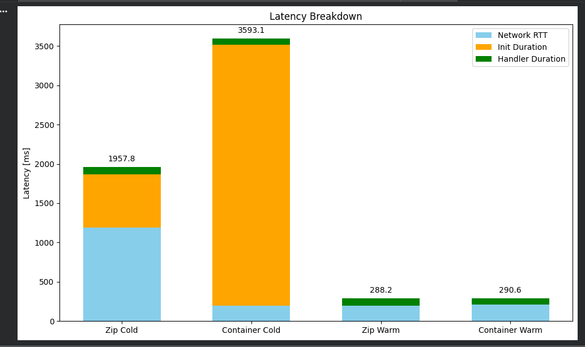

### Assignment 2: Scenario A — Cold Start Characterization

| Invocation Type | Init Duration (ms) | Handler Duration (ms) | Total Latency (ms) | Network RTT (ms)               |
| --------------- | ------------------ | --------------------- | ------------------ | ------------------------------ |
| Zip Cold        | 680.41             | 88.76                 | 1957.8             | 1188.63 (=1957.8−680.41−88.76) |
| Container Cold  | 3316.05            | 77.03                 | 2371.9             | −1021.18 / ~200 around       |           |
| Zip Warm        | 0                  | 88.76                 | 288.2              | 199.44 (=288.2−88.76)          |
| Container Warm  | 0                  | 77.03                 | 290.6              | 213.57 (=290.6−77.03)          |

Zip cold starts are faster than container cold starts. Zip deployment packages are smaller and simpler, so Lambda can initialize the execution environment quickly. The cold start mostly involves creating a new runtime, loading the zip code, and starting the function. Container deployment requires loading a full container image, starting the container runtime, and initializing all included dependencies, which takes significantly longer.

---

### Assignment 3: Scenario B — Warm Steady-State Throughput

| Environment | Concurrency | p50 (ms) | p95 (ms) | p99 (ms) | Server avg (ms) |
|---|---|---|---|---|---|
| Lambda (zip) | 5 | 241.0104 | 421.3647 | 643.8023 | 265.4114 |
| Lambda (zip) | 10 | 245.7 | 442.9 | 1223.9 | 286.7 |
| Lambda (container) | 5 | 231.1565 | 351.5810 | 696.9667 | 241.5507 |
| Lambda (container) | 10 | 234.9170 | 307.1483 | 638.6558 | 243.9542 |
| Fargate | 10 | 811.5 | 1105.5 | 1362.1 | 825.5 |
| Fargate | 50 | 4010.8 | 4327.6 | 4869.6 | 3910.0 |
| EC2 | 10 | 460.2 | 819.9 | 1033.5 | 527.5 |
| EC2 | 50 | 439.7123 | 630.7511 | 733.6618 | 453.3939 |

- Explain why Lambda p50 barely changes between c=5 and c=10 (each request gets its own execution environment), while Fargate/EC2 p50 increases significantly between c=10 and c=50 (requests queue on a single task/instance).
- Explain what causes the latency difference between server-side `query_time_ms` and client-side p50.

Tail latency instability:
- Lambda (zip) c=10
- Lambda (container) c=10

Lambda p50 barely changes because each request runs in its own execution environment - no queuing occurs so the median latency stays stable even as concurrency increases. 
Fargate/EC2 p50 increases with higher concurrency. Requests queue on a single task or instance when multiple requests arrive simultaneously.

The difference in latency arises because of:
- network and transport latency – the time it takes to send the request to the server and receive the response
- serialization/deserialization overhead – processing JSON, HTTPS, or other request/response formats
- server-side queuing – in Fargate/EC2, multiple requests can queue up before being handled by the instance/task
- Lambda platform overhead – function initialization, container management, and API Gateway routing add additional latency 

---

### Assignment 4: Scenario C — Burst from Zero

| Environment | Concurrency | p50 (ms) | p95 (ms) | p99 (ms) | Max (ms) | Cold Starts |
|---|---|---|---|---|---|---|
| Lambda (zip) | 10 | 252.2 | 360.6 | 2094.3 | 2094.9 | 680.41 |
| Lambda (container) | 10 | 248.4 | 343.3 | 2006.3 | 2125.8 | 3316.05 |
| Fargate | 50 | 4005.5 | 4330.8 | 4683.9 | 5073.7 | - |
| EC2 | 50 | 456.8090 | 738.1565 | 751.2954 | 751.3389 | - |

Lambda (zip) c=10 - p99 = 2094.3 ms
Lambda (container) c=10 - p99 = 2006.3 ms
Fargate c=50 - p99 = 4683.9 ms, 
EC2 c=50 - p99 = 751.3 ms

Lambda functions can experience cold starts - the first request to a new execution environment must initialize the runtime, load the code/container, and establish connections, this adds significant latency to some requests, which inflates p99. Fargate/EC2 tasks are always running, so they don’t experience this spike - their latency distribution is more consistent.

Warm requests reuse already initialized execution environments (low latency) and cold-start requests hit a new environment (high latency) - this creates a bimodal distribution in the latency histogram.

Lambda (zip) p99 = 2094.3 ms
Lambda (container) p99 = 2006.3 ms

No, Lambda does not meet the p99 < 500 ms SLO during burst traffic. What would neet to change to meet the SLO:
- keep a number of Lambda environments warm to eliminate cold starts
- reduce container startup time, minimize dependencies, or use smaller deployment packages
- smooth bursts so new environments are pre-warmed
